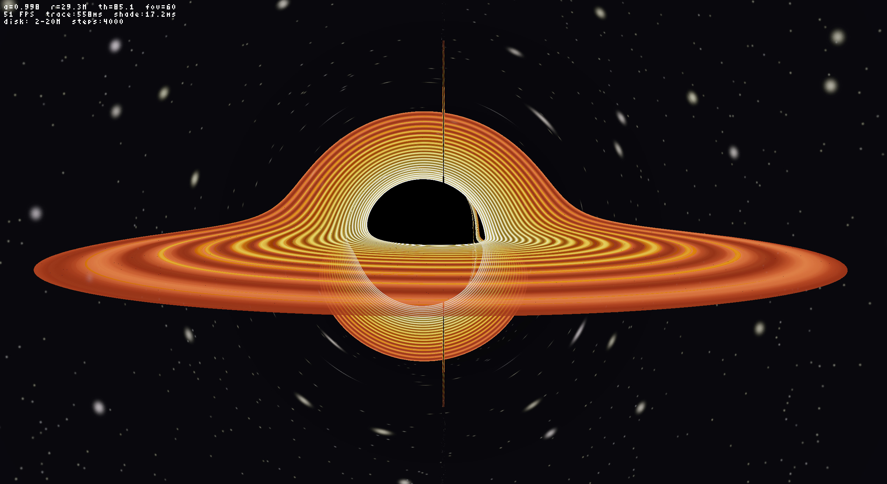

# Kerr Black Hole Gravitational Lensing Simulation
### v1.2.1 — GPU Accelerated Ray Tracer

A real-time **gravitational lensing ray tracer** for a spinning (Kerr) black hole with an accretion disk. Uses a **trace/shade split architecture** — geodesics traced once via **OpenCL** GPU compute, then re-shaded every frame for smooth disk animation. **OpenGL/GLFW** display with interactive orbital camera, bloom post-processing, and configurable parameters via command line.




---

## What's New in v1.2.1

Visual detail improvements on top of v1.2. Same architecture — animation stays at full framerate.

| Feature | Description |
|---------|-------------|
| Higher-order photon rings | 4000 integration steps (was 2000) with 5-tier adaptive step sizing. Resolves tertiary disk images — thin bright arcs wrapping over the shadow edge. |
| Procedural turbulence | 3-octave FBM noise modulates disk temperature at each crossing. Hotspots and spiral structure evolve with rotation. |
| ISCO emissivity spike | Bright inner ring at the innermost stable orbit — physically motivated by the plunging region. |
| Gravitational redshift on stars | Stars near the shadow edge are dimmed and reddened based on closest approach. |

---

## What's New in v1.2

Configurable simulation, on-screen diagnostics, screenshot capture, and performance optimization.

| Feature | Description |
|---------|-------------|
| Command-line parameters | `--spin`, `--disk-inner`, `--disk-outer`, `--steps`, `--width`, `--height`, `--distance`, `--theta`, `--fov`, `--help` |
| On-screen HUD | Press H to toggle — shows spin, camera position, FPS, trace/shade times, disk and step config |
| Screenshot capture | Press F12 — saves timestamped PPM to `Screenshots/` directory (auto-created) |
| Dynamic kernel config | Spin, disk radii, and max steps injected into the GPU kernel at build time via OpenCL defines |
| GPU tone mapping | Reinhard + sRGB gamma moved into the shade kernel — eliminates CPU per-pixel post-processing on the fast path |
| Bloom parallelized | Gaussian blur passes use OpenMP for multi-threaded CPU execution |
| sRGB gamma LUT | Precomputed 4096-entry lookup table replaces per-pixel `powf` calls |
| Texture upload | `glTexSubImage2D` reuses allocated texture instead of reallocating every frame |

---

## What's New in v1.1

This release makes the simulation feel alive. No physics changes — purely visual and perceptual improvements.

| Feature | Description |
|---------|-------------|
| Rotating accretion disk | Disk material orbits at Keplerian velocity with differential rotation — inner edge spins faster than outer |
| Continuous rendering | The image updates every frame, not just on camera input |
| Bloom / glow | Bright regions of the disk bleed light outward, simulating overexposure |
| sRGB gamma correction | Proper monitor-space output — darker regions gain depth, brighter regions pop |
| Smooth camera | Camera interpolates smoothly to target position instead of snapping |

---

## What This Simulates

This is not an artistic approximation — the simulation solves the actual equations of motion for photons (light rays) in the gravitational field of a spinning black hole. Every pixel on screen is the result of a photon trajectory integrated backward from the camera through the Kerr spacetime geometry.

The visual features emerge directly from the physics:

- **Photon sphere** — a bright ring where light orbits the black hole on unstable circular paths
- **Einstein ring** — background light focused into a ring by gravitational lensing
- **Accretion disk bending** — the disk appears to wrap over and under the black hole because photons from the far side are deflected over the top and bottom
- **Doppler beaming** — one side of the disk appears brighter than the other because material orbiting toward the camera is blueshifted (brighter) and material receding is redshifted (dimmer)
- **Shadow (silhouette)** — the dark region where all photons fall into the event horizon

The spin parameter defaults to **a = 0.998M** (configurable via `--spin`) — matching the near-extremal Kerr black hole used in the *Interstellar* visual effects (Gargantua used a ≈ 0.9999).

---

## Getting Started

### Clone the Repository

```bash
git clone git@github.com:mendsergon/Kerr-Black-Hole-Simulation.git
cd Kerr-Black-Hole-Simulation
```

### Install Dependencies

The Makefile auto-detects the Linux distribution:

```bash
make deps
```

**Arch Linux:**
```bash
sudo pacman -S glfw mesa glu glm opencl-headers ocl-icd
sudo pacman -S rocm-opencl-runtime   # AMD GPU
sudo pacman -S opencl-nvidia         # NVIDIA GPU
sudo pacman -S intel-compute-runtime # Intel GPU
```

**Ubuntu / Debian:**
```bash
sudo apt install libglfw3-dev libgl1-mesa-dev libglu1-mesa-dev libglm-dev opencl-headers ocl-icd-opencl-dev
sudo apt install mesa-opencl-icd     # AMD GPU
sudo apt install nvidia-opencl-dev   # NVIDIA GPU
sudo apt install intel-opencl-icd    # Intel GPU
```

**Fedora:**
```bash
sudo dnf install glfw-devel mesa-libGL-devel mesa-libGLU-devel glm-devel opencl-headers ocl-icd-devel
sudo dnf install mesa-libOpenCL      # AMD GPU
```

### Build

```bash
make
```

For a debug build with symbols:
```bash
make debug
```

### Run

```bash
./blackhole                          # Default: a=0.998, 1280x720
./blackhole --spin 0.5               # Lower spin — rounder shadow
./blackhole --spin 0.999 --steps 3000  # Near-extremal with finer integration
./blackhole --width 1920 --height 1080 # Higher resolution
./blackhole --help                     # Show all options
```

### Controls

| Input | Action |
|-------|--------|
| Left-click + Drag | Orbit camera around the black hole |
| Scroll Up | Zoom in (decrease camera distance) |
| Scroll Down | Zoom out (increase camera distance) |
| + / - | Increase / decrease field of view |
| R | Reset camera to default position |
| H | Toggle HUD overlay |
| F12 | Save screenshot to `Screenshots/` |
| ESC | Exit |

---

## The Physics

This section documents every equation used in the simulation. The implementation follows the same formalism used in the *Interstellar* visual effects paper by Oliver James, Eugénie von Tunzelmann, Paul Franklin, and Kip Thorne (2015).

### Units

The simulation uses **geometrized units** where G = c = 1. All distances are measured in units of the black hole mass M. In these units:

- Schwarzschild radius: r_s = 2M
- Event horizon (Kerr): r_+ = M + √(M² - a²)
- Speed of light: c = 1
- Gravitational constant: G = 1

### The Kerr Metric

A rotating black hole is described by the Kerr solution to Einstein's field equations. In Boyer-Lindquist coordinates (t, r, θ, φ), the line element is:

```
ds² = -(1 - 2Mr/Σ) dt²
      - (4Mar sin²θ / Σ) dt dφ
      + (Σ / Δ) dr²
      + Σ dθ²
      + ((r² + a²)² - a²Δ sin²θ) sin²θ / Σ  dφ²
```

Where the key auxiliary functions are:

```
Σ = r² + a² cos²θ
Δ = r² - 2Mr + a²
A = (r² + a²)² - a²Δ sin²θ
```

- **Σ** encodes the oblateness of the Kerr geometry
- **Δ** vanishes at the event horizons (r = r_±)
- **A** appears in the frame-dragging terms
- **a = J/(Mc)** is the spin parameter (angular momentum per unit mass)

The off-diagonal `dt dφ` term is responsible for **frame dragging** — spacetime itself is dragged in the direction of the black hole's rotation.

### Event Horizon

The outer event horizon is located where Δ = 0:

```
r_+ = M + √(M² - a²)
```

For our spin a = 0.998M, this gives r_+ ≈ 1.063M — very close to M, which is a consequence of the near-extremal spin.

### Photon Geodesics

Photons (massless particles) follow **null geodesics** — paths through spacetime where ds² = 0. In the Kerr metric, these paths are determined by the geodesic equation:

```
d²x^μ / dλ² + Γ^μ_αβ (dx^α/dλ)(dx^β/dλ) = 0
```

where λ is the affine parameter along the ray and Γ^μ_αβ are the Christoffel symbols derived from the metric.

Rather than computing all 40 independent Christoffel symbols, we use the **Hamiltonian formulation**, which is equivalent but more efficient.

### Hamiltonian Formulation

The photon Hamiltonian is:

```
H = (1/2) g^μν p_μ p_ν = 0    (null condition)
```

where g^μν is the contravariant (inverse) metric and p_μ are the covariant momenta. The contravariant metric components are:

```
g^rr      = Δ / Σ
g^θθ      = 1 / Σ
g^tt      = -A / (ΣΔ)
g^tφ      = -2Mar / (ΣΔ)
g^φφ      = (Δ - a² sin²θ) / (ΣΔ sin²θ)
```

These are derived from the matrix inverse of the covariant metric, using the fact that det(g_{tφ block}) = -Δ sin²θ.

### Constants of Motion

The Kerr metric has two Killing vectors (∂/∂t and ∂/∂φ), giving two conserved quantities:

- **E = -p_t** — photon energy (conserved due to time-translation symmetry)
- **L = p_φ** — angular momentum about the spin axis (conserved due to axisymmetry)

Additionally, the Kerr metric possesses a hidden symmetry described by the **Carter constant Q**, associated with a Killing tensor. Together, (E, L, Q) completely determine the photon orbit.

### Equations of Motion

Hamilton's equations give the evolution of the dynamical variables (r, θ, p_r, p_θ):

```
dr/dλ     = ∂H/∂p_r     = (Δ/Σ) p_r
dθ/dλ     = ∂H/∂p_θ     = (1/Σ) p_θ
dp_r/dλ   = -∂H/∂r      (computed numerically)
dp_θ/dλ   = -∂H/∂θ      (computed numerically)
dφ/dλ     = g^φφ L - g^tφ E
```

The derivatives ∂H/∂r and ∂H/∂θ are computed via **central finite differences** on the Hamiltonian:

```
∂H/∂r ≈ [H(r + ε, θ) - H(r - ε, θ)] / (2ε)
```

with ε = 10⁻⁴. This avoids the error-prone task of analytically differentiating the metric components while introducing negligible numerical error.

### Integration Method

The geodesic equations are integrated using **4th-order Runge-Kutta** (RK4) with an adaptive step size:

| Distance from BH | Step size (dλ) |
|-------------------|----------------|
| r > 10M | 0.04 |
| 5M < r ≤ 10M | 0.02 |
| 3M < r ≤ 5M | 0.01 |
| r ≤ 3M | 0.005 |

Smaller steps near the black hole prevent integration errors in the strong-field region where the curvature is extreme. Each ray is integrated for up to 2000 steps.

### Camera Model — ZAMO Tetrad

The camera is modeled as a **Zero Angular Momentum Observer** (ZAMO) — a locally non-rotating observer hovering at fixed (r, θ) in the Kerr spacetime. The ZAMO is the most natural local reference frame because it has zero angular momentum relative to the black hole, while co-rotating with the frame-dragging velocity.

The ZAMO frame is defined by the tetrad:

```
Lapse:   α = √(ΣΔ / A)
Shift:   ω = 2Mar / A     (frame-dragging angular velocity)

Tetrad legs (contravariant components):
  e_t^μ   = (1/α, 0, 0, ω/α)
  e_r^μ   = (0, √(Δ/Σ), 0, 0)
  e_θ^μ   = (0, 0, 1/√Σ, 0)
  e_φ^μ   = (0, 0, 0, 1/(sinθ √(A/Σ)))
```

For each pixel, a ray direction (n_r, n_θ, n_φ) is computed from the pixel's screen coordinates and the camera FOV. The photon 4-momentum in coordinate basis is:

```
p^t     = 1/α
p^r     = n_r √(Δ/Σ)
p^θ     = n_θ / √Σ
p^φ     = ω/α + n_φ / (sinθ √(A/Σ))
```

The conserved quantities (E, L) and initial momenta (p_r, p_θ) are then extracted by lowering indices with the covariant metric.

### Ray Tracing Algorithm

For each pixel, the algorithm proceeds as:

1. **Compute ray direction** from pixel coordinates using the ZAMO tetrad
2. **Convert to initial conditions** (r, θ, p_r, p_θ, E, L)
3. **Integrate backward in time** using RK4 (negative affine parameter)
4. **At each step, check for:**
   - **Equatorial plane crossing** → accretion disk intersection
   - **r ≤ r_+ + ε** → photon absorbed by event horizon (black pixel)
   - **r > 50M with p_r < 0** → photon escaped (sample star field)
5. **Composite disk crossings** using front-to-back alpha blending (disk is semi-transparent, allowing multiple crossings to contribute)

---

## Accretion Disk Model

### Geometry

The accretion disk is modeled as a **geometrically thin disk** in the equatorial plane (θ = π/2), extending from r = 2M (inner edge) to r = 20M (outer edge). Rays that cross the equatorial plane within the disk radii register a hit. Multiple crossings are recorded (up to 3 per ray), producing primary, secondary, and higher-order lensed images.

The inner edge is chosen slightly outside the innermost stable circular orbit (ISCO). For a prograde orbit around a Kerr black hole with a = 0.998M, the ISCO is at r ≈ 1.24M. We use r = 2M for visual clarity.

### Radiative Transfer

At each equatorial crossing, the disk contributes emission and opacity via front-to-back compositing:

```
color += (1 - alpha) × opacity × emission(r, φ, t)
alpha += (1 - alpha) × opacity
```

The emission at each crossing is computed in the shade kernel with animated rotation, procedural noise, Doppler beaming, and ISCO glow — all evaluated per-frame for smooth animation without re-tracing.

### Temperature Profile

The base disk temperature follows the standard thin-disk profile:

```
T(r) ∝ (r_inner / r)^(3/4)
```

This is modulated by three effects: Doppler beaming (brightness asymmetry), procedural turbulence (hotspots and structure), and an ISCO emissivity spike (bright inner ring).

### ISCO Emissivity Spike

At the innermost stable circular orbit, matter transitions from orderly circular flow to a plunge toward the horizon. This transition region emits intensely:

```
boost = 1 + 3 × exp(-(r - r_ISCO)² / 0.5)
```

This produces a physically motivated bright inner ring.

### Procedural Turbulence

Real accretion disks exhibit magnetohydrodynamic turbulence. We approximate this with 3-octave fractal Brownian motion noise evaluated at (r, φ, t):

```
turb = fbm3(r × 0.8, φ_disk × 1.5, t × 0.15)
T_final = T_base × doppler × (0.6 + 0.8 × turb)
```

The noise creates hotspots, spiral density waves, and filamentary structure that evolve over time as the disk rotates.

### Doppler Beaming

The accretion disk material orbits at approximately the Keplerian velocity:

```
v_orb = 1 / (√r + a)     (prograde circular orbit in Kerr)
```

The Doppler factor is:

```
g = 1 / (γ(1 + v_orb sin φ))
```

where γ = 1/√(1 - v²). The observed intensity scales as I ∝ g⁴ (relativistic beaming), causing the approaching side to appear dramatically brighter.

### The "Ring Bend" — Gravitational Lensing of the Disk

The most striking visual feature is the disk appearing to wrap around the black hole. Photons from the far side are deflected over the top and bottom by extreme curvature, arriving at the camera from above and below the silhouette. With the volumetric model, rays passing through the disk volume at oblique angles accumulate more color than those passing through edge-on, producing natural limb-brightening effects.

With 4000 integration steps and finer step sizes near the photon sphere (h = 0.004 at r < 2.5M), rays that orbit one or more times before escaping resolve tertiary and quaternary disk images — thin bright rings stacked progressively closer to the shadow edge.

---

## Rendering

### Trace/Shade Architecture (v1.2.1)

The renderer uses a two-kernel architecture. The trace kernel records equatorial crossings and closest-approach distance. The shade kernel evaluates disk color with noise, ISCO glow, and Doppler every frame — animation is free.

| Kernel | Cost | When | What |
|--------|------|------|------|
| `raytrace` | 100–400 ms | Camera moves | Traces geodesics (4000 steps), records crossing positions + min_r → g-buffer |
| `shade` | 2–5 ms | Every frame | Evaluates noise + ISCO glow + Doppler at cached crossings, applies gravitational redshift to stars, tone mapping, gamma |

When the camera is still, only the shade kernel runs — smooth 50+ FPS disk animation at full resolution. The 4000-step integration (vs 2000 in v1.2) resolves higher-order photon ring images but makes the initial trace slower.

### Resolution Tiers

| Mode | Resolution Scale | When |
|------|-----------------|------|
| Drag | 50% | While mouse button is held (retrace) |
| Settling | 50% | Camera lerping to rest (retrace) |
| Waiting | 70% | Camera nearly settled (shade only if g-buffer exists) |
| HQ snapshot | 100% | After camera settles for 0.3s (retrace + bloom) |
| Continuous | 100% | After HQ frame (shade only — free) |

### Post-Processing

- **Reinhard tone mapping** — compresses HDR to [0,1]: `L = L / (1 + L)`. Applied on GPU in the shade kernel (fast path) or on CPU (bloom path).
- **Bloom glow** — applied once on the HQ snapshot. Extracts pixels above luminance 0.75, two-pass separable Gaussian blur (OpenMP parallelized), composited at 40% strength.
- **sRGB gamma correction** — proper transfer function for monitor output. GPU-accelerated on the fast path, LUT-accelerated on the CPU path.

### Star Field

Two-layer procedural star field with 3×3 neighbor cell lookups to prevent cutoff artifacts. Stars near the black hole shadow edge are visibly reddened and dimmed by gravitational redshift — the shade kernel applies a frequency ratio g ≈ √(1 − r_h/r_min) based on each ray's closest approach to the horizon, shifting color toward red and reducing brightness as g³ (with green and blue dimming progressively faster).

---

## GPU Acceleration

The simulation automatically detects available OpenCL devices and selects the best GPU. Each pixel is one GPU work item — the entire frame is computed in a single kernel launch.

| GPU Vendor | Supported Runtimes |
|------------|-------------------|
| AMD | ROCm, Mesa rusticl |
| NVIDIA | CUDA OpenCL, nvidia-opencl |
| Intel | intel-compute-runtime |

To verify OpenCL is configured correctly:
```bash
make gpu-info
# or
clinfo
```

If no GPU is detected, the simulation falls back to CPU computation with OpenMP parallelization.

### Performance

| Configuration | Resolution | Trace Time | Shade Time | Animation FPS |
|--------------|------------|------------|------------|---------------|
| Discrete GPU (RDNA3) | 1280×720 | 100–400 ms | 2–5 ms | 50–60+ |
| Discrete GPU (RDNA3) | 2560×1440 (70%) | 200–600 ms | 5–10 ms | ~50 |
| Discrete GPU | 640×360 (drag) | 30–80 ms | <2 ms | Smooth |
| CPU (8-core, OpenMP) | 1280×720 | 5–15 sec | N/A | No animation |

Trace is ~2× slower than v1.2 due to 4000 steps (vs 2000) with finer step sizes near the photon sphere. Animation remains at full framerate since noise, ISCO glow, and Doppler are evaluated in the shade kernel.

---

## Accuracy

| Property | Accurate? | Notes |
|----------|-----------|-------|
| Metric | ✅ Exact Kerr | Boyer-Lindquist coordinates, spin configurable |
| Geodesics | ✅ RK4 integrated | Hamiltonian formulation, adaptive step, 4000 steps |
| Lensing geometry | ✅ Yes | Higher-order images resolved (tertiary, quaternary) |
| Photon sphere | ✅ Yes | Emerges from geodesic integration |
| Frame dragging | ✅ Yes | ZAMO tetrad includes ω shift |
| Doppler beaming | ✅ Approximate | Uses Keplerian v, simplified g-factor |
| Disk thickness | ❌ Thin | Equatorial plane crossings, no volumetric RT |
| Disk turbulence | ⚠️ Procedural | 3D FBM noise at crossings, not MHD-derived |
| ISCO emission | ✅ Approximate | Emissivity spike at inner edge |
| Gravitational redshift | ✅ Approximate | Stars redshifted by g ≈ √(1 − r_h/r_min) |
| Disk emission | ❌ Simplified | T ∝ r^(−3/4), no full radiative transfer spectrum |
| Polarization | ❌ Not modeled | No Stokes parameters |

---

## Project Structure

| File | Lines | Description |
|------|-------|-------------|
| `main.cpp` | 450 | GLFW window, OpenGL, camera controls, trace/shade render loop, post-processing |
| `blackhole.h` | 167 | SimConfig, Camera, GPURayTracer class, function declarations |
| `blackhole.cpp` | 1048 | GPU init, kernel management, CPU fallback, bloom, gamma LUT, HUD, screenshots, CLI parser |
| `blackhole.cl` | 553 | Two OpenCL kernels: `raytrace` (4000-step geodesic integration → g-buffer) and `shade` (noise + ISCO + Doppler + redshift → pixels) |
| `Makefile` | 62 | Cross-platform build with auto dependency detection |

---

## Known Limitations

- **Procedural turbulence only** — disk structure comes from FBM noise, not from GRMHD simulation data. Visually convincing but not physically derived.
- **No polarization** — real observations (e.g., the EHT image of M87*) show polarization patterns from the magnetic field structure, which this simulation does not model.
- **Simplified radiative transfer** — emission and absorption coefficients are tuned for visual appearance, not derived from plasma physics (synchrotron, bremsstrahlung).
- **Coordinate singularity at poles** — θ = 0 and θ = π are clamped to 0.01 rad to avoid division by zero in the metric components.
- **GPU→CPU readback bottleneck** — pixel data is read back from GPU to CPU every frame for texture upload. OpenCL-GL interop (planned for v3.0) would eliminate this.

---

## References

1. **Kerr, R.P.** (1963). "Gravitational Field of a Spinning Mass as an Example of Algebraically Special Metrics." *Physical Review Letters*, 11(5), 237–238.
2. **Carter, B.** (1968). "Global Structure of the Kerr Family of Gravitational Fields." *Physical Review*, 174(5), 1559–1571.
3. **Bardeen, J.M., Press, W.H., Teukolsky, S.A.** (1972). "Rotating Black Holes: Locally Nonrotating Frames, Energy Extraction, and Scalar Synchrotron Radiation." *The Astrophysical Journal*, 178, 347–369.
4. **James, O., von Tunzelmann, E., Franklin, P., Thorne, K.S.** (2015). "Gravitational Lensing by Spinning Black Holes in Astrophysics and in the Movie Interstellar." *Classical and Quantum Gravity*, 32(6), 065001.

---

## License

This project is licensed under the MIT License — see the [LICENSE](LICENSE) file for details.
